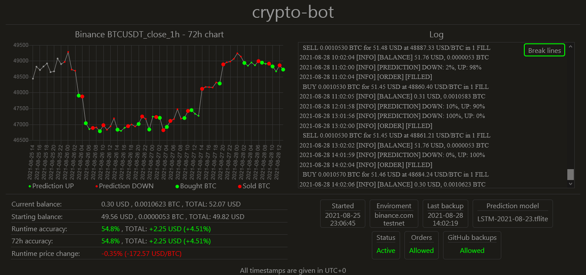

# crypto-bot



## Contents
1. <a href="#about">About</a>
2. <a href="#crypto-bot-botpy">crypto-bot (bot.py)</a>
	- <a href="#installation">Installation</a>
	- <a href="#setup">Setup</a>
	- <a href="#running">Running</a>
	- <a href="#optional-github-backups">[OPTIONAL] GitHub backups</a>
3. <a href="#info-site-apppy">info-site (app.py)</a>
4. <a href="#usage">Usage</a>
5. <a href="#training">Training</a>
6. <a href="#tools-and-tests">Tools and tests</a>

## About
This archive contains the source code of "crypto-bot", which is a cryptocurrency trading bot (`bot.py`) together with info-site (`app.py`) created with Flask.

It is designed to work in 1h intervals (data gathering, making predictions, placing orders) on Binance, the biggest cryptocurrency exchange. It is configured to predict BTC, basing on hourly data of 12 selected cryptocurrencies. Its features:

- data gathering and trading using binance.com API
- neural network (LSTM) predictor trained on Google Colab
- automatic data backups using Git
- info-site with logs and stats using Flask
- implemented on Raspberry Pi Zero W (armv6l)


## crypto-bot (`bot.py`)

### Installation
1. Install **Raspberry PI OS Lite** (tested on 2021-05-07 release) and setup internet access. Make sure to have **Python 3.7** and **git** installed. The default working directory is assumed to be ```/home/pi/```.
2. Clone this repository
	```sh
	git clone https://github.com/kamsec/crypto-bot.git
	```
3. Install requirements
	```sh
	cd crypto-bot
	pip3 install -r requirements.txt
	```

### Setup
4. Run `setup.py` with command:
	```sh
	python3 setup.py
	```
	It will create the files `config.ini`, `secrets.ini`, `logfile.log`.
5. In order to check the balances and operate Binance account, bot needs to have access to API keys. In `secrets.ini` you will find the following content:
	```
	[DEFAULT]
	testnet_api_key = ***
	testnet_api_secret = ***
	mainnet_api_key = ***
	mainnet_api_secret = ***
	```
	In place of `***` placeholders provide your binance.com API keys  (testnet or/and mainnet) without any quotation marks. Visit https://www.binance.com/en/support/faq/360002502072 for more information.
	[OPTIONAL] To enable orders, in `config.ini` you can set:
	```
	orders_allowed = True
	```
	In `config.ini` you can also change working binance.com enviroment between `testnet` and `mainnet` according to provided keys.
	```
	enviroment = testnet  # can be changed to mainnet
	```
### Running
6. Run the bot with:
	```sh
	python3 bot.py
	```
	If everything works correctly it will produce the output in logfile.log of the following format:
	```sh
	2021-08-23 09:32:45 [INFO] Bot started
	2021-08-23 09:32:47 [INFO] [BALANCE] 0.29 USD, 0.0010283 BTC
	2021-08-23 09:32:47 [INFO] [PREDICTION] DOWN: 42%, UP: 58%
	```
	If an hour haven't passed from last record in `data/` folder, the message
	```sh
	"[WARNING] [UPDATE] No new records available yet. Try again in: 0:47:50.464589" 
	```
	will appear and `[PREDICTION]` will not be made this hour, but this is correct. Bot will also create `logfile.csv` which is used only by Flask info-site (`app.py`).
7. In order to make the bot working at the beginning of every hour (1st minute), add the cron job. Enter the command:
	```
	crontab -e
	```
	and at the end of the opened file add the following line:
	```sh
	1 * * * * cd /home/pi/crypto-bot && python3 /home/pi/crypto-bot/bot.py
	```

### [OPTIONAL] GitHub backups
8. In order to create GitHub backups bot requires a remote repository and SSH key for authentication. Having remote repository defined, create new ssh key:
	```sh
	ssh-keygen -t rsa -b 4096 -C "your_email@example.com"
	```
	When the prompts appear, press enter three times so the file will be saved in default location `/home/pi/.ssh/` under default name `id_rsa` with no passphrase.
	Open the ssh agent with command
	```shell
	eval "$(ssh-agent -s)"
	```
	and add created key
	```shell
	ssh-add ~/.ssh/id_rsa
	```
	Now add the SSH key to your account on GitHub, and create repository for this bot. For more information, see https://docs.github.com/en/github/authenticating-to-github/adding-a-new-ssh-key-to-your-github-account.
	In `config.ini` set:
	```
	backups_allowed = True
	```
Instructions from this section will make `bot.py` script running once in the first minute of every hour.

## info-site (`app.py`)
After running crypto-bot for the first time, you can view the results on Flask info-site, by running:
```sh
python3 app.py
```
and visiting the `http://IP:5000/` in your browser (port is always 5000, but you need to check the IP assigned to your Raspberry Pi), for example http://192.168.0.107:5000/.
If you want to host the Flask info site on Raspbery Pi as service, you can use Gunicorn with nginx. To do this, take the folliwing steps:
1. Install nginx.
	```sh
	sudo apt-get install nginx
	```
2.  Create `crypto-bot` file in `/etc/nginx/sites-available/` with the following comand:
	```sh
	sudo nano /etc/nginx/sites-available/crypto-bot
	```
	and write the following content (assumed localhost and port 5000):
	```sh
	server {
		listen 80;
		server_name 123.123.123.123;

		location / {
			proxy_pass http://127.0.0.1:5000;
			proxy_set_header Host $host;
			proxy_set_header X-Forwarded-For $proxy_add_x_forwarded_for;
			proxy_set_header X-Scheme $scheme;
		}
	}
	```
3.  Create `crypto-bot.service` file in `/etc/systemd/system/` with the following comand:
	```sh
	sudo nano /etc/systemd/system/crypto-bot.service
	```
	and write the following content (assumed localhost and port 5000):
	```sh
	[Unit]
		Description=Gunicorn instance to serve crypto-bot
		After=network.target

	[Service]
		User=pi
		Group=pi
		WorkingDirectory=/home/pi/crypto-bot
		# Environment="PATH=/home/pi/crypto-bot/myprojectenv/bin" # if using virtual env
		ExecStart=/home/pi/.local/bin/gunicorn --bind 0.0.0.0:5000 --workers 3 wsgi:app
		Restart=always

	[Install]
		WantedBy=multi-user.target
	```
	Add and start the service with commands:
	```
	sudo systemctl daemon-reload
	sudo systemctl enable crypto-bot.service
	sudo systemctl start crypto-bot.service
	```
You can now visit information site on your RaspberryPi IP on port 5000, e.g.  http://192.168.0.107:5000/, and this site will be available whenever Raspberry Pi is running and has internet connection.
To access the site outside the local network, you should perform port forwarding in your router settings.

## Usage
- To control the configuration of the bot, you can edit constants in`config.ini`, for example:
	```sh
	status_active = True  # set to False to make the bot inactive
	orders_allowed = False  # set to True to allow placing orders
	backups_allowed = False  # set to True to allow GitHub backups
	enviroment = testnet  # set to mainnet to change binance.com enviroment
	```
	
- To stop the bot completely, type:
	```sh
	crontab -e
	```
	and remove or comment the line that defines cron job:
	```sh
	1 * * * * cd /home/pi/crypto-bot && python3 /home/pi/crypto-bot/bot.py
	```
- To restart the bot (erase log history and reset balances), delete `logfile.log`, `config.ini`, `logfile.csv` (if exists) and run :
	```sh
	python3 setup.py
	python3 bot.py
	```
- To control Flask info-site, you can use commands:
	```sh
	sudo systemctl stop crypto-bot.service  # to stop the app
	sudo systemctl restart crypto-bot.service  # to restart the app
	```
- To change the prediction model place new model in `models/model/`, and in `config.cfg` set:
	```sh
	model_path = models/model/***
	```
    and in `setup.py` set the variable
	```sh
	MODEL_NAME = '***'
	```
    with `***` as new model name.

## Training
Training neural network models is performed manually on Google Colab, and files used for it are located in `training-google-colab` directory.

## Tools and tests
Tools for adding new data pairs and running bot simulation (placing orders during using past data) are located in `tools/` directory.
In main directory, file `tests.py` contains tests and allows to run&test individial functions from the project.


